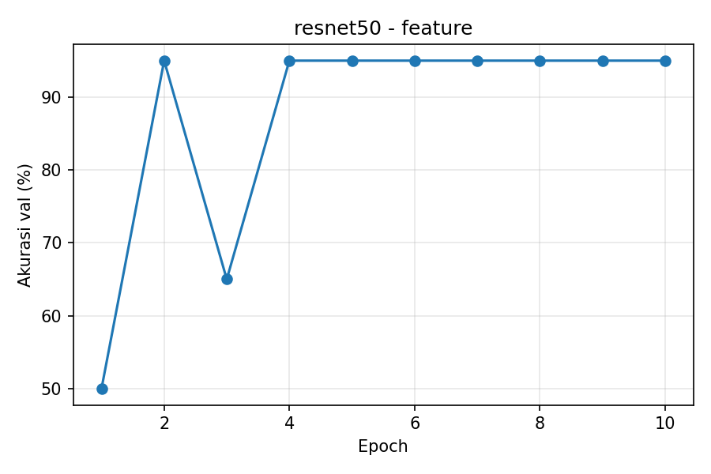
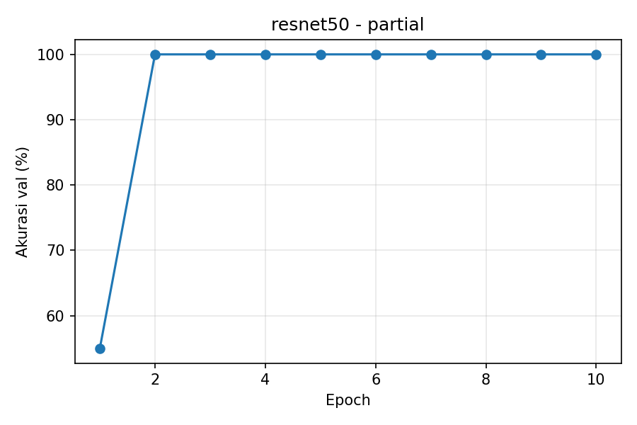
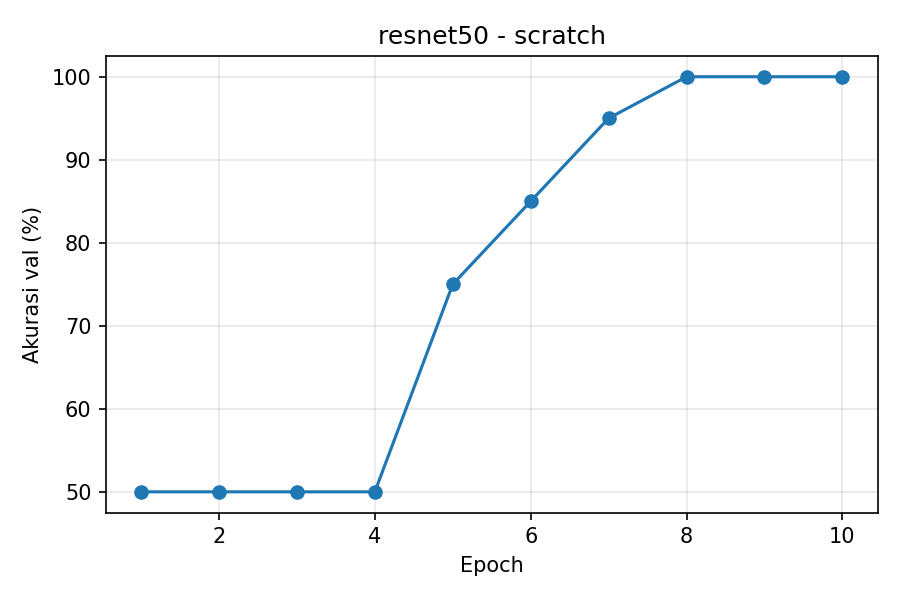

# AIoT Smart Locker — ResNet-50 Face ID

**RET503 · Pertemuan 3 · Ester Aprilyani Pandiangan · 4222401026**
**Program Studi Teknologi Rekayasa Robotika · Politeknik Negeri Batam**

## 1. Deskripsi Proyek

Proyek ini merupakan eksperimen pengembangan modul Face ID untuk sistem AIoT Smart Locker menggunakan arsitektur **ResNet-50**. Model digunakan untuk melakukan klasifikasi wajah pengguna terdaftar ke dalam dua kelas, yaitu Asra dan Ester.

Eksperimen ini bertujuan untuk membandingkan performa ResNet-50 menggunakan tiga pendekatan pelatihan, yaitu Feature Extraction, Partial Fine-Tuning, dan Training from Scratch. Evaluasi dilakukan berdasarkan akurasi validation dan waktu training sebagai bagian dari analisis performa model.

## 2. Dataset

Dataset utama yang digunakan terdiri dari 100 gambar wajah dengan dua kelas.

| Kelas     | Jumlah gambar |
| --------- | ------------: |
| Asra      |            50 |
| Ester     |            50 |
| **Total** |       **100** |

### Pembagian Dataset

Dataset dibagi menggunakan stratified random split dengan rasio 80:20.

| Dataset    |   Asra |  Ester |   Total |
| ---------- | -----: | -----: | ------: |
| Training   |     40 |     40 |      80 |
| Validation |     10 |     10 |      20 |
| **Total**  | **50** | **50** | **100** |

Dataset digunakan untuk melatih dan mengevaluasi model. Karena data masih terbatas dan berasal dari sesi pengambilan yang sama, hasil validation belum menggambarkan kemampuan generalisasi model pada semua kondisi nyata.

Foto wajah tidak disertakan dalam repository GitHub untuk menjaga privasi pengguna.

## 3. Preprocessing

Tahapan preprocessing yang digunakan meliputi:

* Membaca gambar wajah.
* Mengubah gambar ke format RGB.
* Melakukan resize gambar sesuai input model.
* Mengubah gambar menjadi tensor.
* Melakukan normalisasi sebelum dimasukkan ke model.

## 4. Arsitektur Model ResNet-50

Eksperimen menggunakan **ResNet-50 pretrained ImageNet** untuk pendekatan Feature Extraction dan Partial Fine-Tuning, serta bobot awal acak untuk Training from Scratch.

Classifier disesuaikan dengan dua kelas wajah, yaitu Asra dan Ester.

### Mode Training

| Mode                  | Bobot awal | Layer yang dilatih               |
| --------------------- | ---------- | -------------------------------- |
| Feature Extraction    | ImageNet   | Classifier saja                  |
| Partial Fine-Tuning   | ImageNet   | Sebagian backbone dan classifier |
| Training from Scratch | Acak       | Seluruh model                    |

Ketiga mode dijalankan dengan dataset yang sama untuk melihat perbedaan hasil pelatihan.

## 5. Hasil Eksperimen

Eksperimen ResNet-50 menghasilkan akurasi validation terbaik dan waktu training sebagai berikut.

| Mode Training         | Akurasi Validation Terbaik | Waktu Training |
| --------------------- | -------------------------: | -------------: |
| Feature Extraction    |                        95% |      1,0 menit |
| Partial Fine-Tuning   |                       100% |      1,2 menit |
| Training from Scratch |                       100% |      3,0 menit |

### Grafik Akurasi

**Feature Extraction**



**Partial Fine-Tuning**



**Training from Scratch**



Data hasil training per epoch tersedia pada file CSV di folder `results/`.

## 6. Analisis Hasil

Berdasarkan eksperimen, Feature Extraction memperoleh akurasi validation terbaik sebesar 95%, sedangkan Partial Fine-Tuning dan Training from Scratch mencapai 100%.

Waktu training pada Feature Extraction adalah sekitar 1,0 menit, Partial Fine-Tuning sekitar 1,2 menit, dan Training from Scratch sekitar 3,0 menit.

Hasil ini menunjukkan bahwa ketiga pendekatan menghasilkan performa yang berbeda pada dataset validation yang digunakan. Akurasi validation sebesar 100% tidak secara otomatis menjamin model mampu mengenali wajah dengan akurat dalam kondisi operasional. Pengujian tambahan menggunakan data dari sesi dan kondisi yang berbeda masih diperlukan.

## 7. Pengukuran Latency

Latency merupakan waktu yang diperlukan model untuk menghasilkan prediksi dari sebuah gambar wajah. Pengukuran latency diperlukan untuk mengetahui respons model saat digunakan dalam sistem Face ID Smart Locker.

| Parameter           | Hasil          |
| ------------------- | -------------- |
| Model               | ResNet-50      |
| Perangkat pengujian | CPU            |
| Average latency     | Belum diukur   |
| Minimum latency     | Belum diukur   |
| Maximum latency     | Belum diukur   |
| FPS                 | Belum dihitung |

Pengukuran latency akan dilakukan setelah model yang akan digunakan ditentukan dan proses inference disiapkan. Nilai latency dan FPS akan ditambahkan berdasarkan hasil pengujian aktual, bukan estimasi.

## 8. Unit Komputasi dan Kamera

Informasi perangkat kamera dan unit komputasi untuk implementasi akhir perlu dilengkapi berdasarkan perangkat yang digunakan pada pengujian dan integrasi Smart Locker.

| Komponen                    | Spesifikasi                    |
| --------------------------- | ------------------------------ |
| Model                       | ResNet-50                      |
| Framework                   | PyTorch                        |
| Perangkat training          | CPU                            |
| Kamera                      | Menunggu spesifikasi perangkat |
| Unit komputasi implementasi | Menunggu spesifikasi perangkat |

## 9. Struktur Folder

```text
smart-locker-faceid/
├── scripts/
│   └── train.py
├── results/
│   ├── acc_resnet50_feature.png
│   ├── acc_resnet50_partial.png
│   ├── acc_resnet50_scratch.png
│   ├── log_resnet50_feature.csv
│   ├── log_resnet50_partial.csv
│   ├── log_resnet50_scratch.csv
│   └── summary.csv
├── dataset_raw/       # Dataset lokal, tidak diunggah
├── .gitignore
└── README.md
```

File model hasil pelatihan (`.pth`) dan dataset foto wajah tidak disertakan dalam repository GitHub karena ukuran file dan pertimbangan privasi.

## 10. Keterbatasan dan Pengembangan

Keterbatasan eksperimen ini meliputi:

* Dataset hanya terdiri dari 100 gambar wajah.
* Eksperimen menggunakan dua kelas wajah.
* Validation hanya terdiri dari 20 gambar.
* Data training dan validation berasal dari sesi pengambilan yang sama.
* Pengujian latency dan pengujian pada perangkat implementasi belum dilengkapi.

Pengembangan selanjutnya dapat dilakukan dengan:

* Menambah jumlah gambar dan variasi kondisi pengambilan.
* Menguji model menggunakan sesi pengambilan data yang berbeda.
* Melakukan pengujian latency dan FPS pada perangkat target.
* Menguji model dengan wajah yang tidak terdaftar untuk mendukung kebutuhan verifikasi Face ID.
* Mengintegrasikan model dengan sistem server dan perangkat fisik Smart Locker.

## 11. Kesimpulan

Eksperimen ini menguji tiga pendekatan pelatihan pada arsitektur ResNet-50 untuk klasifikasi wajah dalam sistem AIoT Smart Locker. Akurasi validation terbaik yang diperoleh adalah 95% pada Feature Extraction dan 100% pada Partial Fine-Tuning serta Training from Scratch.

Hasil eksperimen menjadi dasar untuk pengujian lebih lanjut, khususnya pada data yang lebih beragam, pengukuran latency, dan implementasi pada perangkat target.

**Program Studi Teknologi Rekayasa Robotika**
**Politeknik Negeri Batam**
